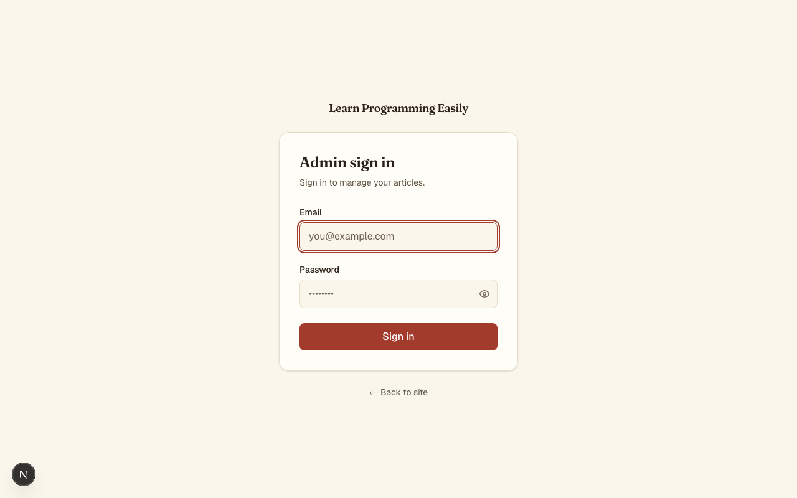

<!-- ch-3 personal-project report. Copy this file to ch-3/<your-github-username>/report.md -->
<!-- Before you pass: your project repo needs at least 3 GitHub stars (ask teammates
     to open your repo and click ⭐). This proves it is a real, shared project. -->
# ch-3 Personal Project — Report

github_username: HtunAungKyaw73
personal_repo_url: https://github.com/HtunAungKyaw73/Learn-Programming-Easily
project_summary: A single-author CMS for publishing programming articles, using a hybrid MDX+PostgreSQL content model with an admin panel, client-side search, RSS, and full SEO.
slides_url: [slides/pitch.md](/slides/pitch.md)
intro_slides_url: [slides/intro.md](/slides/intro.md)

## Methodology

I followed the **Superpowers methodology** — Spec Driven Development (SDD). Before writing any code, I defined the full architecture, database schema, tech stack, and phased implementation plan in a project spec (`CLAUDE.md` and memory files). Claude Code then executed against that spec: each phase produced a working vertical slice (schema → rendering → admin → polish) committed to Git. The spec acted as the single source of truth, keeping implementation aligned with design intent and making every commit traceable back to a documented requirement.

## Evidence — Claude Code usage

### MCP
- path: .mcp.json
- what: Two MCP servers — **context7** (`@upstash/context7-mcp`) for fetching up-to-date library documentation (Next.js, Prisma, Auth.js, Tailwind) during implementation, and **magic** (`@21st-dev/magic`) for generating and refining UI components from the 21st.dev component library.

### Skill
- path: .claude/skills/test-feature/SKILL.md
- what: A TDD discipline skill that ensures every feature with logic gets at least one focused Vitest test before being marked done — enforces test-first workflow, deterministic mocking, and one-behavior-per-test conventions.

### Agent
- path: .claude/agents/test-runner.md
- what: A lightweight Haiku-powered agent that runs the Vitest suite under Node 22 and returns a terse pass/fail summary — used for quick CI-style feedback without leaving the Claude Code session.

## Screenshots

### Homepage (light)

### Homepage (dark)

### Article page

### Admin sign-in

