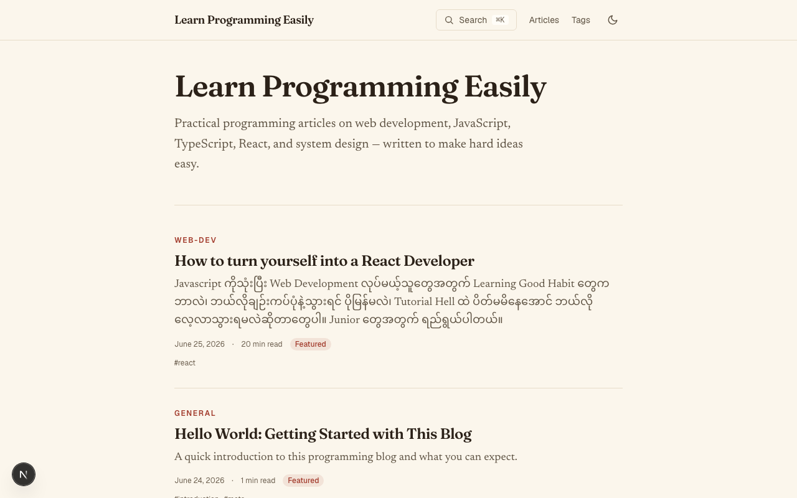
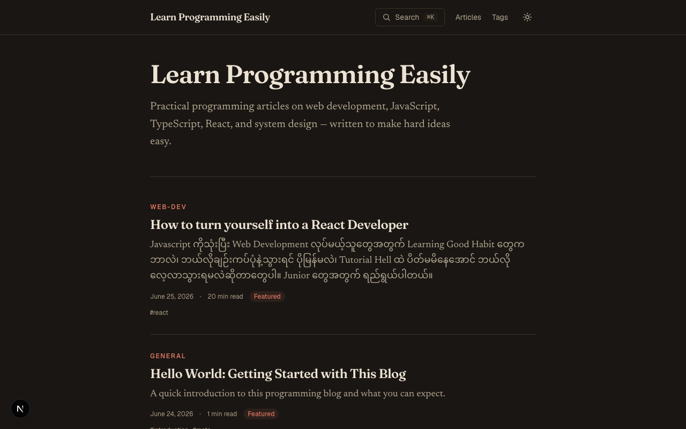
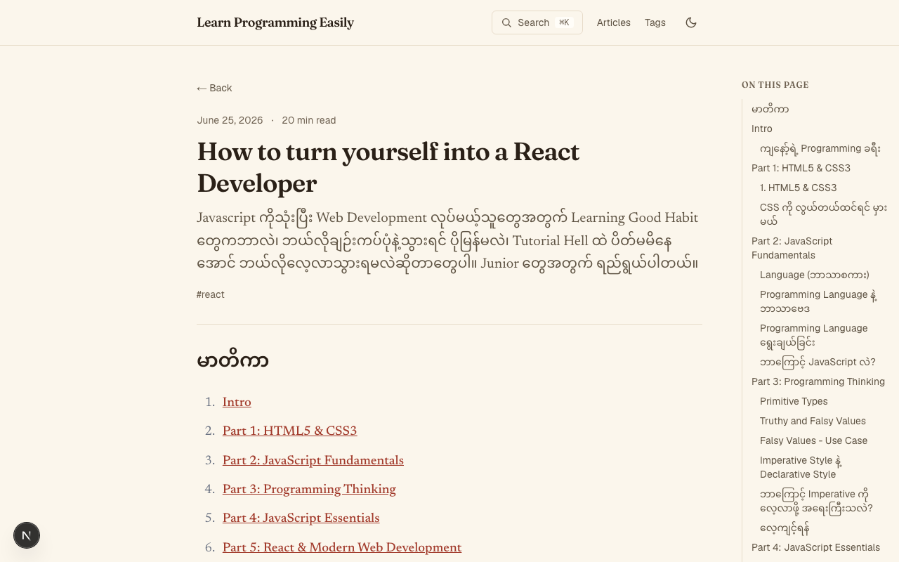

<!-- _class: lead -->
<!-- _paginate: false -->

<span class="tag">Programming CMS</span>

# Learn Programming Easily

### Write in MDX. Publish a fast, beautiful programming blog.

<span class="muted">A lightweight, self-hosted CMS for a single author — by [HtunAungKyaw73](https://github.com/HtunAungKyaw73)</span>

---

## What it is

**Learn Programming Easily** is a single-author CMS for publishing programming articles — without the bloat of WordPress or the walled gardens of Medium.

It uses a **hybrid content model**:

- 📝 Article body lives as **`.mdx` files** — version-controlled, IDE-editable
- 🗄️ Metadata (title, tags, status, dates) lives in **PostgreSQL**
- ⚡ Public pages are **statically generated** for speed and SEO

> Write Markdown, click publish, own your content.

---

## Who it's for

| Audience | Why they need it |
|---|---|
| 🧑‍💻 **Solo developers** | Want to publish technical writing without running a heavy CMS |
| ✍️ **Technical writers** | Need clean prose + flawless multi-language code blocks |
| 🌏 **Community educators** | Share knowledge locally, keep full ownership of content |
| 🛠️ **Tinkerers** | Want a modern, extensible codebase they actually control |

The person who wants to **write and publish** — not wrestle with infrastructure.

---

## What it does

- 🎨 **Beautiful code** — Shiki syntax highlighting, light + dark themes
- 🔍 **Instant search** — client-side Fuse.js, ⌘K from anywhere
- 🗂️ **Tags & categories** — browsable, organized archives
- 🧭 **Table of contents** — auto-generated, scroll-synced per article
- 🔐 **Admin panel** — auth-protected CRUD via Server Actions
- 📡 **Built-in distribution** — RSS 2.0 feed, sitemap, JSON-LD, OG images
- 📱 **SEO + responsive** — fast pages Google can actually find

---

## See it — the reading experience

 

<span class="muted">Warm-paper editorial design with one-click **light / dark** mode.</span>

---

## See it — articles & navigation



MDX content with **syntax-highlighted code**, a scroll-synced **table of contents**, tags, and reading time — built for long technical reads.

---

## Under the hood

**Stack:** Next.js 16 · React 19 · TypeScript · Tailwind CSS v4 · PostgreSQL · Prisma 7 · Auth.js v5 · Shiki · Fuse.js

- **Server Components by default** — `"use client"` only where needed
- **Server Actions** for mutations — no API-route boilerplate
- **Auth.js v5 credentials** — single admin, bcrypt + JWT, no adapter
- **SSG public site** — admin panel dynamic behind auth
- Built with **Spec-Driven Development** — architecture defined before code

---

<!-- _class: dark -->

## Get started

**Live:** `https://articles.htunaungkyaw.online`

**Code:** [github.com/HtunAungKyaw73/Learn-Programming-Easily](https://github.com/HtunAungKyaw73/Learn-Programming-Easily)

```bash
git clone https://github.com/HtunAungKyaw73/Learn-Programming-Easily
npm install
npm run dev   # → localhost:3000
```

### Write. Publish. Own your words.
